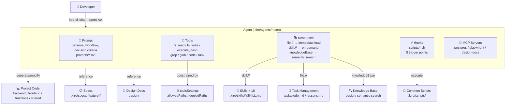
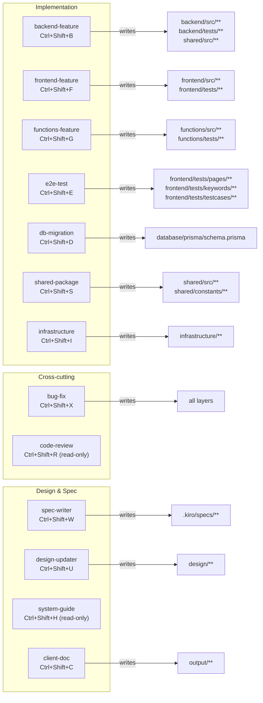
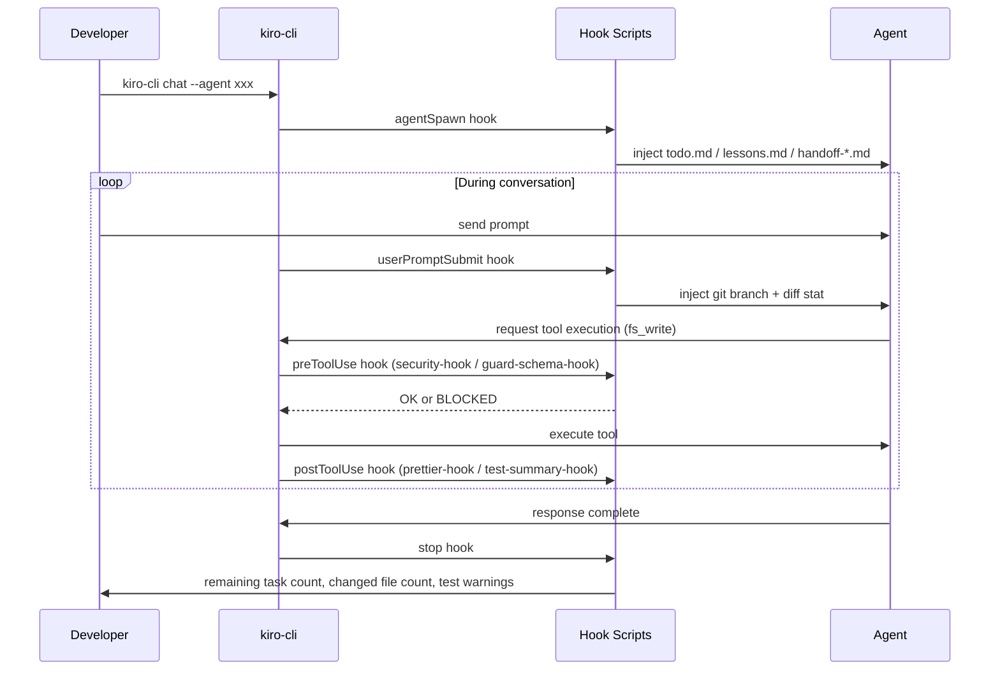
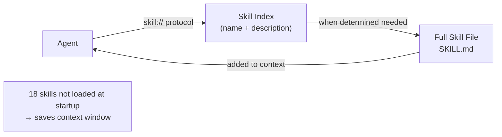

# kiro-cli Architecture Diagrams

> Visualizes the overall structure of kiro-cli configuration with Mermaid diagrams.
> Last updated: 2026-05-10 | kiro-cli 2.1.1

---

## 1. Overall Structure

---

## 2. Agent Structure — 13 Agents and Write Scopes

---

## 3. Hook Lifecycle

---

## 4. Skill Reference Mechanism

