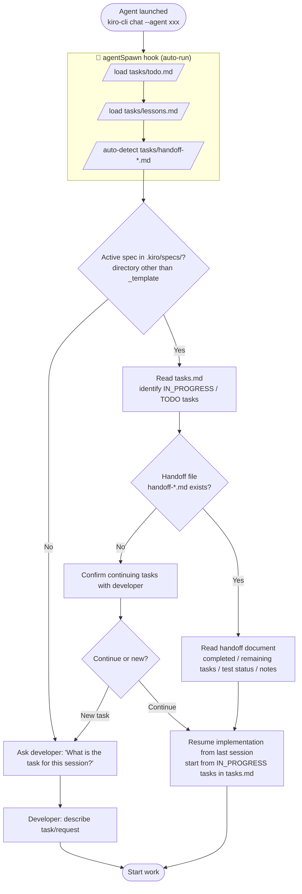

# Session Start Protocol

> **Common starting point for all flows.** All agents begin work from this protocol.
> The `agentSpawn` hook runs automatically — no manual action required from the developer.

---

## Flow Diagram

---

## Notes

### Why tasks/lessons.md is referenced

By reviewing mistake patterns and improvements recorded in past sessions every time,
the same errors are prevented from recurring.

### Auto-detection of active specs

If a directory other than `_template` exists in `.kiro/specs/`,
it is treated as a spec with implementation in progress, and that directory's `tasks.md` is auto-loaded.
Also, the `userPromptSubmit` hook displays the active spec path on every prompt submission.

### Multi-session handoff

For work spanning multiple sessions, `tasks/handoff-{feature}.md` is used.
The `agentSpawn` hook auto-detects `tasks/handoff-*.md`,
and if the file exists, displays the first 10 lines to inject handoff information into the agent.

### Constraint on switching with `/agent` command

When switching agents with `/agent xxx` during a chat, **the agentSpawn hook does not fire**.
Therefore, for agent switches across phases, it is recommended to use
`/quit` → `kiro-cli chat --agent xxx` to launch as a new session.

### Session end check by stop hook

When the agent's response completes, `stop-hook.sh` runs automatically and reports:
- Remaining task count (incomplete items in `tasks/todo.md`)
- Changed file count (warning if over 20)
- Test not-run warnings
