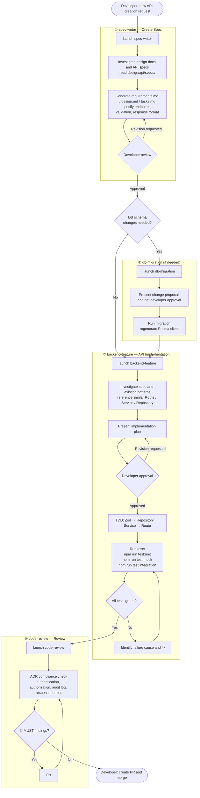

# New Backend API Development

> Flow for developing a Backend API standalone, without Frontend.
> For internal batch APIs, microservice communication APIs, etc.

---

## Flow Diagram

---

## Notes

- **ADR Checklist (required)**
  - ADR-001: `/api` prefix, no dynamic routes
  - ADR-003: List response `{ contents, totalCount, offset, limit }`
  - ADR-005: Logical delete only
  - ADR-006: Optimistic lock (version check)
  - ADR-007: Use `getCurrentDate()`
  - ADR-008: `.js` extension imports
