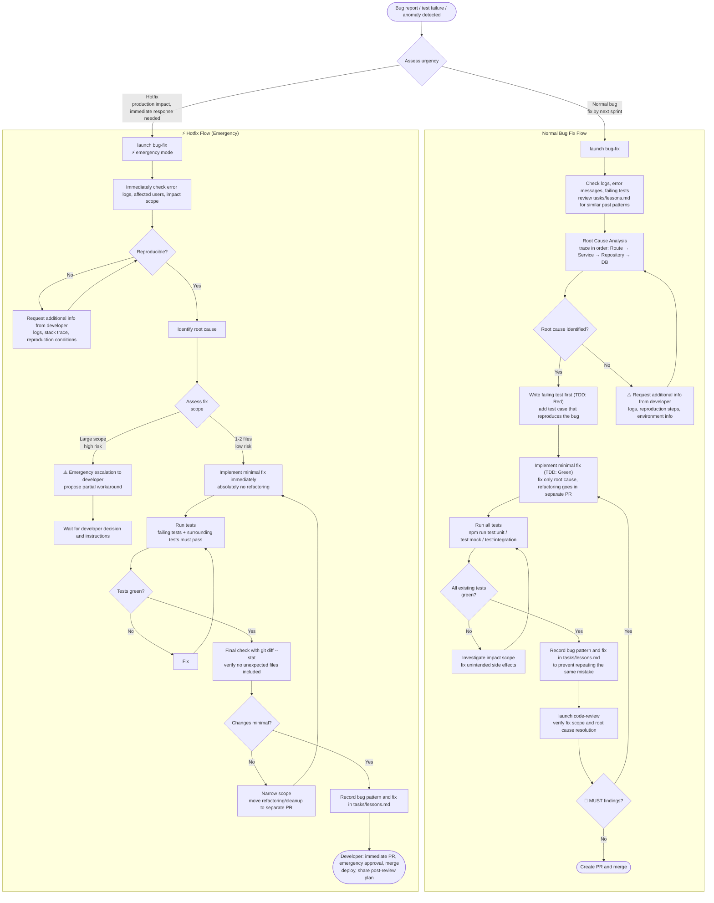

# Bug Fix

> Has two flows: normal bug fix and hotfix (emergency response).
> Both share the same principle: start with Root Cause Analysis and make minimal fixes.

---

## Flow Diagram

---

## Notes

### Criteria for Normal Bug vs Hotfix

| Criteria | Normal Bug | Hotfix |
|---------|-----------|--------|
| Production impact | None or minor | Yes (data corruption, outage, security) |
| Response deadline | Next sprint | Same day to hours |
| code-review | Normal flow | Post-review acceptable |
| PR process | Normal | Use emergency approval route |

### Why recording in lessons.md matters

Recording bug patterns prevents repeating the same mistakes in the next session.
ADR violations in particular (missing logical delete, using `new Date()`, creating dynamic routes) must always be recorded.
See the "self-improvement loop" in the `dev-workflow` skill for write triggers and format.

### What NOT to do in hotfixes

- Mix in refactoring (expands scope)
- Skip hooks with `git commit --no-verify`
- Force push with `git push --force`
- Hide symptoms without investigating root cause
