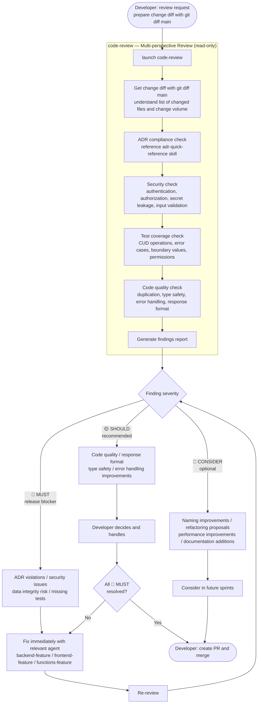

# Pre-Release Code Review

> Flow where the `code-review` agent performs multi-perspective checks for ADR compliance, security, and test coverage before PR creation.
> Read-only agent — does not modify code. Provides findings only.

---

## Flow Diagram

---

## ADR Checklist (items code-review always verifies)

| ADR | Check Content |
|-----|--------------|
| ADR-001 | No `[id]` directory under `frontend/src/app/` |
| ADR-002 | `backend/prisma/` or `functions/prisma/` not directly edited |
| ADR-003 | List API response is `{ contents, totalCount, offset, limit }` format |
| ADR-004 | Route not calling Prisma directly (via Awilix DI) |
| ADR-005 | No `DELETE` SQL or Prisma `delete()` (update to `is_deleted = true`) |
| ADR-006 | Update operations have `version` check (return 409 on mismatch) |
| ADR-007 | `new Date()` not used directly (use `getCurrentDate()`) |
| ADR-008 | Backend imports have `.js` extension |

## Notes

- **CI auto-execution**: `code-review` can run headlessly with `--no-interactive` flag. See `ops/ci-headless.md` for details.
- **🔴 MUST criteria**: Explicitly breaking team-agreed ADRs, security risks, CUD operations without tests
- **Report positive aspects**: Always report well-implemented sections, not just findings
