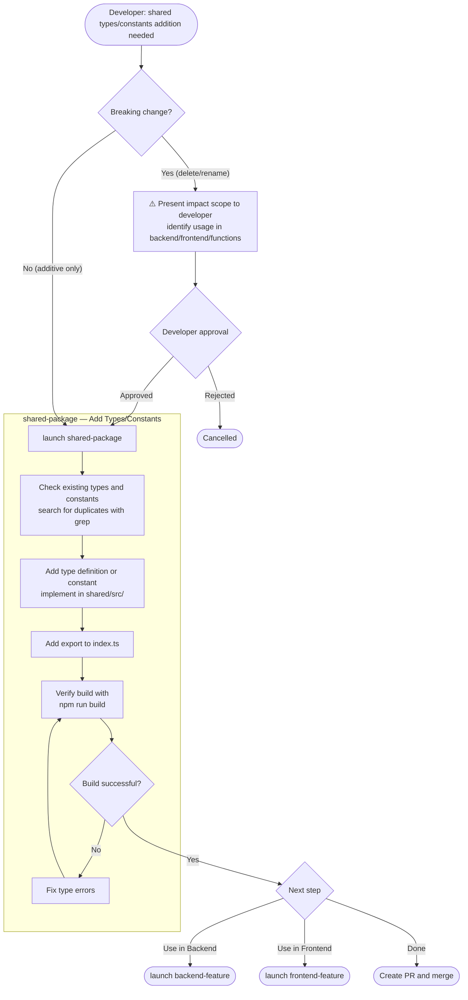

# Shared Package Changes

> Flow for adding type definitions and constants to the `shared` package.
> Breaking changes (deleting or renaming existing types) are prohibited. Additive-only is the principle.

---

## Flow Diagram

---

## Notes

- Complete shared package changes **before other agents** (since backend-feature / frontend-feature will import from it)
- If `npm run build` passes, type consistency is guaranteed
- For breaking changes, plan fixes for all affected packages (backend/frontend/functions) first
