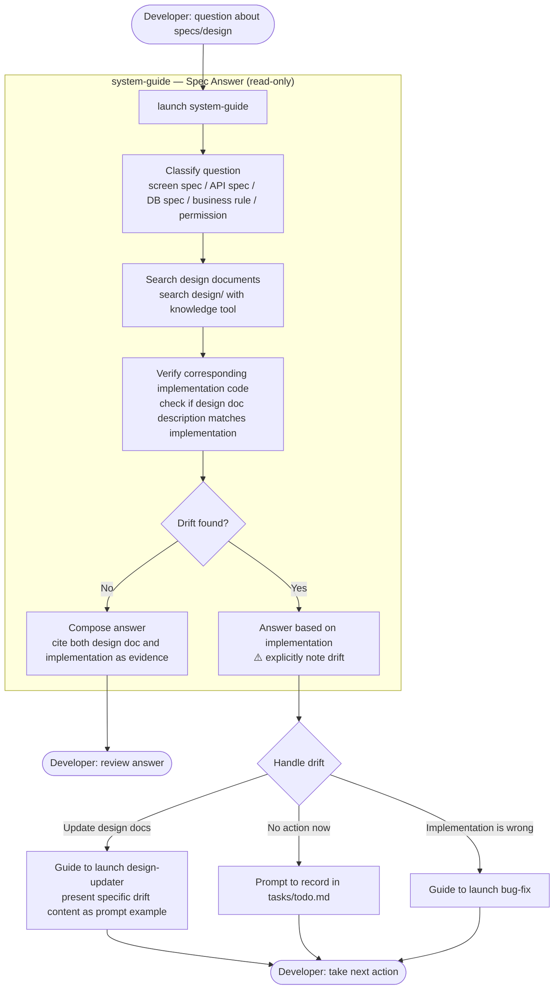
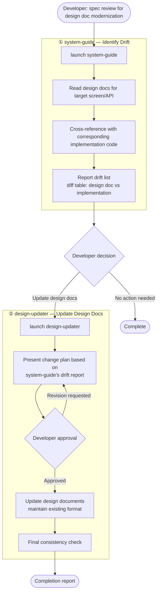

# Specification Review (with Drift Detection)

> Flow where the `system-guide` agent cross-references design documents and implementation code to answer spec questions.
> **Read-only agent — does not modify code or design documents.** When drift is found, guides handoff to `design-updater`.

---

## W16: Spec/Design Questions

---

## W17: Spec Review → Design Doc Update

---

## Notes

- **system-guide is read-only**: Does not modify code or design documents at all. Only finds and reports drift.
- **Treat implementation as source of truth**: If design docs are outdated, the actually running code is the current spec
- **Collaboration with design-updater**: system-guide finds drift, design-updater fixes it
