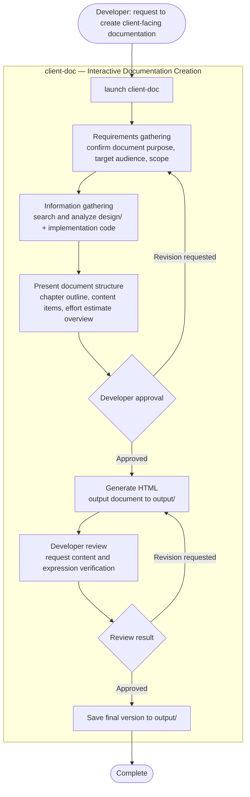

# Client-Facing Documentation

> Flow where the `client-doc` agent references design documents and implementation code to generate client-facing documentation (current specs, improvement proposals, effort estimates) in HTML format.
> **Can only write to output/. Does not modify design documents or implementation code.**

---

## W18: Create Client-Facing Documentation

---

## Notes

- **client-doc can only write to output/**: Does not modify design documents (`design/`) or implementation code at all
- **Effort estimates are AI approximations**: These are AI-generated estimates not based on actual data, and require developer review and adjustment
- **Output format**: Generated as HTML file in output/
